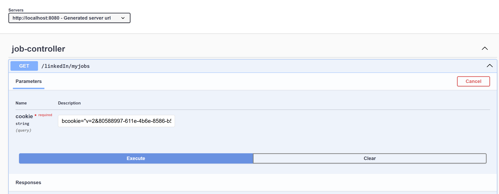
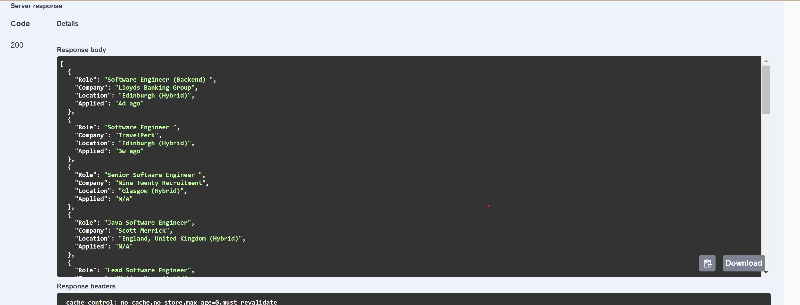

# Getting Started

Steps to start the service and openapi endpoint specification

1. Please start the service
2. After the service has been started  please click the below link , this will open the openapi endpoint -

http://localhost:8080/swagger-ui/index.html

3. The UI should look like below , need to pass the cookie from the request header to execute the request -

4. The response should look like below -

To get the cookie, you need to go to the browser and then after login into LinkedIn , you need to get the cookie from request header param by clicking F12 key.

**The below is a sample copy only (just pasting as an example and should not be used in the testing) and you need to test using your own copy only**

bcookie="v=2&80588997-611e-4b6e-8586-b59fcddf4a09"; bscookie="v=1&20230423212557c18a1b80-3240-434e-886a-27fb3574be0eAQHCXUHkZv7z6rJG3lZMhAsPb2Ao_-vu"; li_theme=light; li_theme_set=app; li_sugr=829c3ccb-e6da-469e-a468-9f5f1bfa10fa; aam_uuid=41267635064598865301594955370483308319; li_alerts=e30=; li_rm=AQELvcFUmsbVmgAAAYsdc3A4LUbGhsiRBE7epCU07m8Vt-UmeP_cWRy2gAphtybsFZ8CuOwiXI3ExQbrNs5P7js3qOs_4jvjAz47FN2O3JChYvJAYhCddt8tLitP51YqR4a23Eb_cCqFB9N10mk1izoR-OTGoOslS9Hn70m4z_ck8MkjrRjN0LwHTdG8I9oX8DPWcmxffb0FozS56Bsn60t9-KnIV7yHBnSfxpnZfIvxKFkKTag8siAFt3y4UYtxmh0p0NElX835sitkEZME9bxKHIclKGaT3tgUj9u_GhkT1pN-Dif7IvFPlAS3xMytVoGPbzi2Xyc_GaTX6qk; visit=v=1&M; dfpfpt=4060177f863447c9b17a642491c9b429; timezone=Europe/London; JSESSIONID="ajax:6168836619986524880"; li_gc=MTsyMTsxNzIxMzc5MTMzOzI7MDIxwfFgDGIaPbvFCkTwycKpc2YxFDGFrSLf9K1JG2sIb2w=; liap=true; li_ep_auth_context=AFlhcHA9YWNjb3VudENlbnRlckh1YixhaWQ9MzQxOTk2MDI2LGlpZD00MzI4MDYwNzQscGlkPTMzNDI0NzY3OCxleHA9MTcyMjUzMTI3MjI4MyxjdXI9dHJ1ZQHnu35KF-HrcWtYX142nciA2aPTSA; _guid=4d1e69a4-83e3-4887-9530-9a6367dfa666; fid=AQFQZRQylzPJvgAAAZNomP4GTgXClq4Da3J9Iq_SqEvMJpQF3u0uVCax61sdkXIxJjgalnOsCiMp7w; _gcl_au=1.1.1212382443.1728038844.998027507.1732712038.1732712037; gpv_pn=developer.linkedin.com%2Fproduct-catalog; s_tp=5434; li_at=AQEFAHQBAAAAABC_HqgAAAGTb-WT-QAAAZOT8hf5TgAAF3VybjpsaTptZW1iZXI6MTc1NDA2MTE4oeAVYNm-dLF_3ECVJrppV0vv-fGV5Yf_bkZbblRya896-whtDvBKmU-8hnkaalq3HhQFrdYs27efgqm75vfTCSTPxdLlZ7dsbLL3WxbOOWCoH0awfOodIntnzZEm3pbg2KrXS0sZin-KpQYqHcqbGcwibdH5748PblKvZIDlxq7uqvmrs2AZiFxBt8kzwdvQl945BQ; mbox=PC#cb7b97d9a26e429c9b9c52cdfc195f8c.37_0#1748303891|session#565a72c915704569bd1d9410a0843c54#1732753751; _uetvid=3da46130609311eeb7c3bfe5b88920d6; s_ips=893; s_tslv=1732751892663; AnalyticsSyncHistory=AQKUVwaga5Ti3wAAAZN6I7TVJWhp-JqJR59evPvX1JG4y_SCEhqJoYK9PivflOR-avh3nrlw74zkvodH1TV4Vg; lms_ads=AQH2hUfa4hNQWwAAAZN6I7WkdR3lJIpPDtV-6Tx4RnAqepYBu__ZJU2jOZ47z2eUdkPQiaUJcdW0iVdA67T5JE1O4C1NHP1Q; lms_analytics=AQH2hUfa4hNQWwAAAZN6I7WkdR3lJIpPDtV-6Tx4RnAqepYBu__ZJU2jOZ47z2eUdkPQiaUJcdW0iVdA67T5JE1O4C1NHP1Q; lang=v=2&lang=en-us; AMCVS_14215E3D5995C57C0A495C55%40AdobeOrg=1; fptctx2=taBcrIH61PuCVH7eNCyH0FWPWMZs3CpAZMKmhMiLe%252bFWQb3Aa%252bPUPvELJIeO6VNCo38c6LnOb34z%252bjnvnw41wnWQliMPPW67%252b%252bCn2G2RFKAta61SdvFeNFlHMPorIsLahTTPnGVF0c1dQxFwAZOu31Jr4VgJ86KL3qVWZGW6ErLSN8Idmq7fCMXgpklJguryRFuTIWPy771%252fnmcLoY1VYKCqwq2%252bE2Ku78pWrBKD2vasRq%252ftg28g73jngBYAtfdjLYsl%252buHWgDR6ghBfiNMtsTLWtON2Ow6FCis7MRc3LntlVsIvUIA6TXtpJTmV%252fN1hAPK%252bGbLMc77cIQamkWk%252biny2mb9jlB6pgwIQtXVGtrk%253d; AMCV_14215E3D5995C57C0A495C55%40AdobeOrg=-637568504%7CMCIDTS%7C20059%7CMCMID%7C41461557838262231131652051719689905364%7CMCAAMLH-1733652762%7C6%7CMCAAMB-1733652762%7CRKhpRz8krg2tLO6pguXWp5olkAcUniQYPHaMWWgdJ3xzPWQmdj0y%7CMCOPTOUT-1733055162s%7CNONE%7CMCCIDH%7C-1746331157%7CvVersion%7C5.1.1; UserMatchHistory=AQK1J_qWvGesOwAAAZOB1GtDg0XZuio8nlPsqp2yDRFZhBsVv2xKmmGcpR9uhxr7ANcwe22smuyoTPXXcR2_BgmaoHyrOcySdpeoSgKWcCXN2-Mz0ADrXRiD5Td7ZN4QTa0NVBPah4fqYw5g8zmelHKPDh3GXk1MCYrZPusvzFn37PaZHHUTrMDLbEwHzDscsuNnhZuBF9WzQy1EobBurku-6Hku0i18n5al5WbZtp-loO1KpWe9VzTrU-o5uaVWrb7U-hoM6aEz7SK0AsoTx8pHFCr6igPvVnbxd5dvcw_mU5iBv9DOVtONxaGGcKLQUa6H6PZCYu7I1ToYBo8WcMzEbUz9spr8WAYcGJo5jRHSIM3IGNJgW-iJcC89ClEvSLGr6DLR4g; lidc="b=TB18:s=T:r=T:a=T:p=T:g=5474:u=1718:x=1:i=1733050003:t=1733066460:v=2:sig=AQGNtuR-xFUj_opixMe4a_ZB2AmLUjta"; __cf_bm=_4ZVgSVIhJEXQbBFhetT.orSJJJ3_DDurHAJlwIYA2w-1733050540-1.0.1.1-LLLYeY2ZLHvHu71zBq2aiySsLjScra_RvXT8u_Cua8N7wobW2maxy6mon56gEZOPKIxVpkUosyiXKWIneVxdVw; li_mc=MTsyMTsxNzMzMDUwODQyOzI7MDIxXJOFyLbniTZawJrqLMcHtg9bVINYP4saOmKfi1uVdj0=

5. For circuitbreaker , below is the url -

http://localhost:8080/actuator/circuitbreakers

